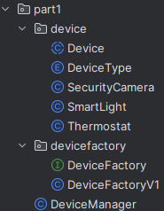
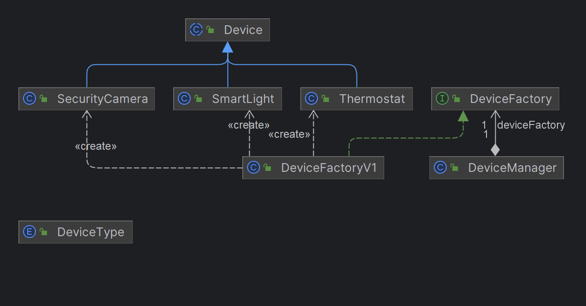

# 스마트 홈 IoT 시스템 프로젝트
## Part1
### 패키지 구조

### 클래스 의존 관계

### 수행한 내용
* 요구한 디자인 패턴(싱글톤, 팩토리)의 구현을 충실히 수행하였음
  * 수행과정에서 Device를 추상 클래스로 만들고, ENUM으로 각 디바이스 타입을 분별하도록 하는 데이터를 추가함
  * DeviceManager 클래스를 예시의 synchronized를 통해 싱글톤 패턴을 구현하였음
* DI
  * DeviceManager에 DeviceFactory 구체화된 클래스 대신 인터페이스를 주입받아서 의존하도록 함
    * 추후 DeviceFactory의 유지보수의 편의성을 위함

### 패턴 이점
#### 싱글톤
- 인스턴스 생성에 많은 비용이 드는 데이터베이스 연결 모듈에 많이 사용되며, 인스턴스 생성을 효율적으로 한다는 장점이 있습니다.
#### 팩토리
- 팩토리패턴이란 상속 관계에 있는 두 클래스에서 상위 클래스가 중요한 뼈대를 결정하고, 하위 클래스에서 객체 생성에 관한 구체적인 내용을 결정하는 패턴입니다.
- 상위 클래스에서는 객체 생성방식에 대해 알 필요가 없어져 유연성을 갖게 되며 객체 생성 로직은 하위클래스에서만 관리 되기 때문에 유지보수성이 증가됩니다

### 회고 및 개선 방안
* DeviceFactory의 인터페이스를 주입받도록 되었지만, 실제 서비스를 구현할 때는 결국 구체 클래스를 넣을 수 밖에 없다.
  * 이를 방지하기 위한 하나의 config 클래스를 추가로 만드는 것이 좋을 것 같다.
* 단위 테스트
  * 정상 동작 위주의 테스트만 작성 한 것 같다.
  * 오류의 경우도 상정해서 추가 작업이 필요할 것 같다.
* final 및 static 설정 관리
  * 시간 상의 이유로 final과 static의 사용이유가 불분명한 곳이 있다.
  * 세밀하게 따져보고 설정할 필요가 있다.